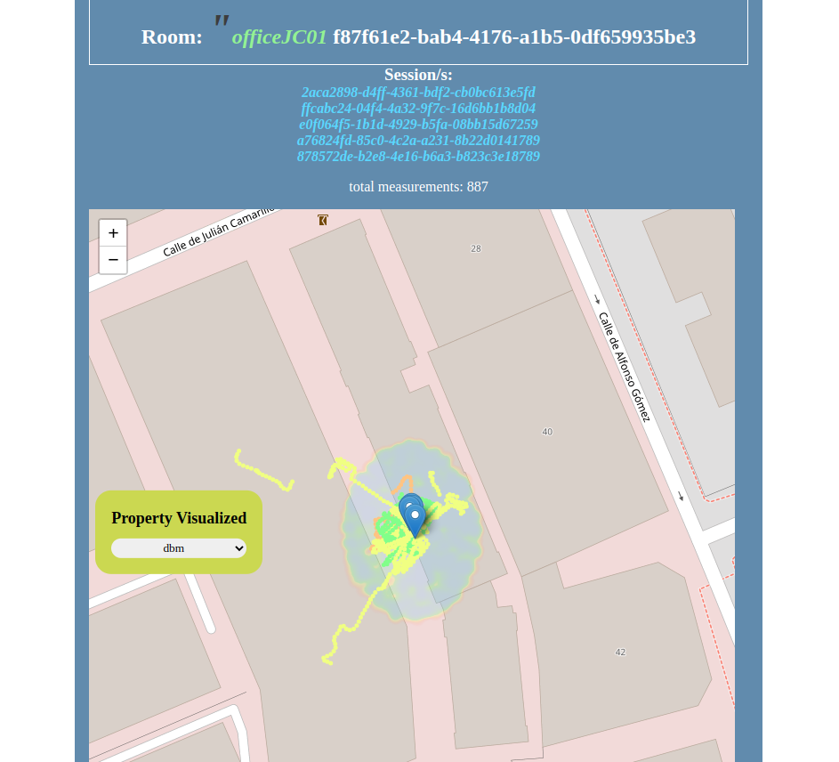

# Indoors 5G measurements mapper

Web based application that centralizes the storage of 5G measurements in indoors environments using an Android app and a Raspberry Pi and represents the points in a 2D world map.
The frontend allows plotting a set of different signal characteristics interactively, as well as creating performing interpolation and estimation on surrounding areas.

## Pending / WIP
- Integration with IA backend to estimate new points
- Allow rotation and redefinition of Lat, Lon origins in a per session basis
- Update estimations so that 