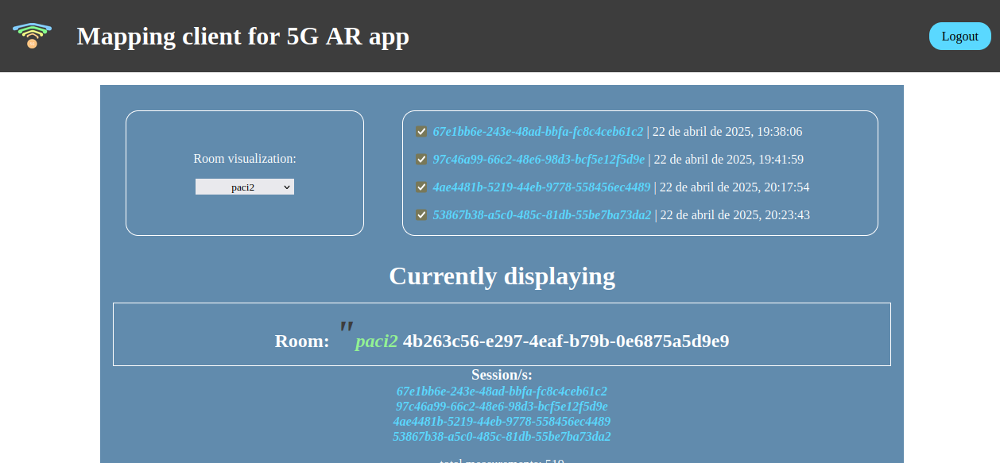
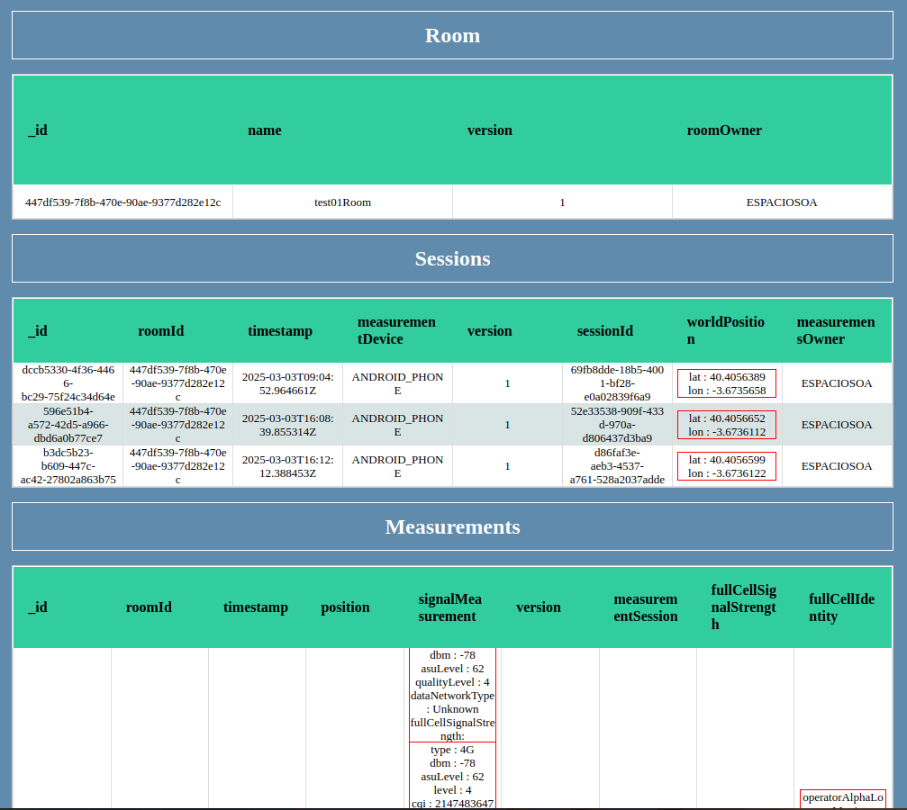

<div align="center" >
  <h1>  InMap - Indoors Signal Mapper (Web visualizer)</h4>
</div>

Prototype of a Web based application that centralizes the storage of 5G measurements recorded in <b>indoors environments</b> using an Android app and a Raspberry Pi and represents the measured points and their properties in a 2D world map.

The application allows plotting a set of different signal characteristics interactively, as well as creating performing interpolation and estimation of cell signal quality on surrounding areas.

The project is deployed at [measurements.espaciosoa.com](measurements.espaciosoa.com)

## About the repo

This project contains both the measurement map visualization code as well as code for the backend REST APIs that enable measuring devices (Android Phones and/or Raspberry Pis) to remotely save measurements generated by users.

## How it works:
Most of the complexity of translating measurements into world space are responsibility of the end device (see Android app code).

Indoor Measurements are estimated by taking local coordinates (respect to the user's phone) and using displacement of the user as a way to estimate the world position "a posteriori". Essentially the approach is to use the last known (lat,lon) location of the phone as the origin of coordinates and perform rotation using gyroscope data to then make the measurement points be projected in a 2D map.
For Raspberry pi measurements, they are all assumed to be part of the closest measurement session in time, since measurements on the pi always correspond to the measurement in the session origin - local (0,0,0) or (lat0,lon0)

## Concepts:
- <b>Rooms</b> : represents an area to be measured, usually this would represent a building. It is a grouping for measurements that occur over time in the same or related conceptual space (building, office, room, etc.)
- <b>Sessions</b>: A session groups measurements performed by a given device on a specific room at a specific time. For instance, every time a user of the Android app measures and sends measurements they generate a session.
- <b>RoomMeasurements</b>: represents each geolocalized measurement point, holding data such as the time od the measurement, signal strength values and cwllular network information.


## Visualization features: 
- Interactive selection which  room measurements to visualize. Possibility of visualizing measurements for different sessions over the same map. The user can zoom in and out of the map and click on a measurement to observe its details and all values measured.
- Displaying a heatmap that shows a range of colors indicating areas with higher or smaller values for measured properties.
- Estimation of new datapoints (via double click in the map)
- raw integration wih IA that generates heatmaps (prototype- the integration code lives in yet another repo)
- Login screen and frontend authentication using https only cookies
- Bare-bones integration with IA for generation of heatmaps (in testing right now) 

## Backend details:
The backend is responsible to centralize the generation of ids of the application and storing data to be visualized. Additionally, measurements from raspberry pis are remapped so that they can be displayed along with phone-captured values.


## How to run
In the production server, run. Note that if the project has just been uploaded, you might need to configure NGINX and use certbot to generate SSL trusted certificates. 
```bash
npm run prod
```
Also make sure that MongoDB is running in the deployment server. 
```sh
sudo systemctl status mongod # check status
sudo systemctl start mongod # use start or restart to init the mongo instance and problems should be gone
``` 
You can use pm2 to run the application forever in production (from the root dir of the site (e.g., `/sites/5G-mapper-backend`))

```sh
pm2 start npm --name "measurements.espaciosoa" -- run prod
# optionally save the process to be able to reload it easily later 
```


## Development

For backend development. It runs nodemon to refresh the server on change of the files.
```bash 
npm run dev 
```
Some of the utility functions have been developed in Typescript, so compilation of these to javascript is necessary. For client side-development, run.
```bash
npm run client-dev
```

## See it in action 

<p align="center">
  
  
  
</p>


## Tech stack: 


### Frontend technologies


 
#### Libraries


### Backend technologies


## Infraestructure configuration 
    
The traffic to the deployment server uses NGINX to redirect traffic directly to the nodejs server  running the application itself locally. 

Let's encrpyt certificates to use ciphered traffic have been generated automatically using Certbot. These are trusted by default from Android devices and thus, bad practices can be avoided (such as using a self-signed certificate)

[](https://certbot.eff.org/)

## Future work | ongoing improvements:
- Properly integrating with AI for heatmap generation (it is extremely slow).


<div align="center" >
 <br/>
  <h3> InMap - Indoors Signal Mapper Suite </h3>
</div>
<p align="center">
<table>
  <tr>
    <td align="center"></td>
    <td align="center">  </td>
    <td align="center"></td>
  </tr>
  <tr>
    <td align="center">🔗<a href="https://github.com/espaciosoa/inmap-app">  Android App </a></td>
    <td align="center">🔗<a href="https://github.com/espaciosoa/inmap"> Web visualizer </a></td>
    <td align="center">🔗<a href="https://github.com/espaciosoa/inmap-pi"> Precise measurement module for Raspberry-Pi</a></td>
  </tr>
</table>
</p>